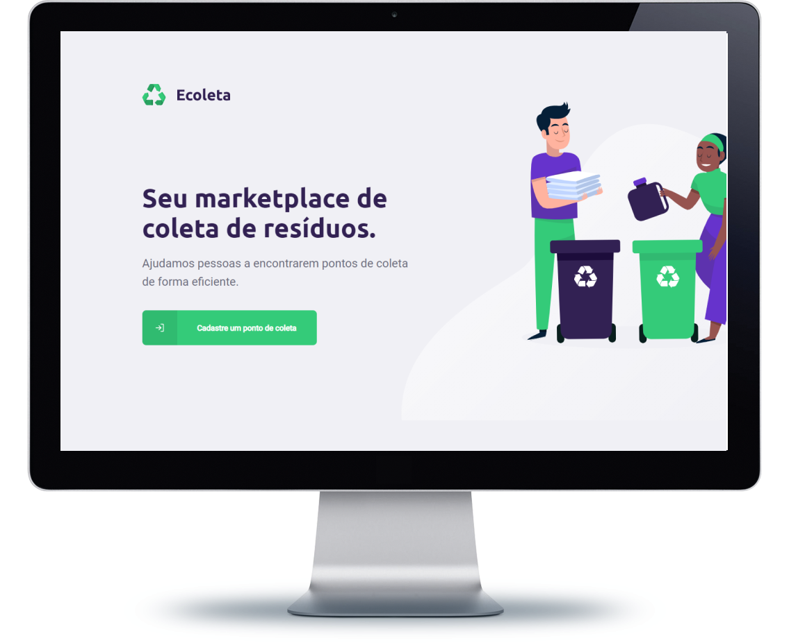
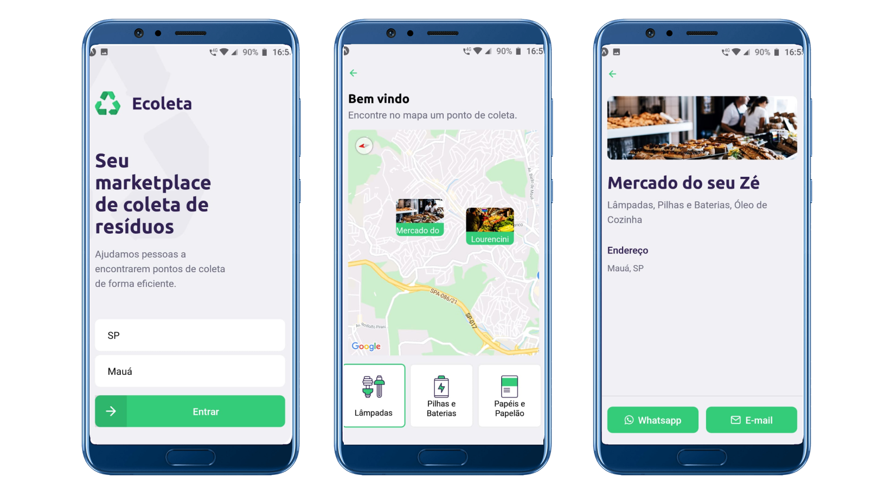

## Projeto Ecoleta NLW

### Este projeto foi desenvolvido na #nextlevelweek um evento de programação online onde é desenvolvida uma aplicação do zero em uma semana com as seguintes techs:

**Node.js 🔩**
**ReactJS 💻**
**React Native 📱**

## Front-end

## Mobile

## Proximos passos

- [ ] Finalizar o CRUD das funcionalidades.
- [ ] Aprimorar a validação.
- [ ] Aprimorar a segurança Backend.
- [ ] Implementar **Styled Component** no Front e Mobile.
- [ ] Dark Theme.
- [ ] Adicionar Testes.
